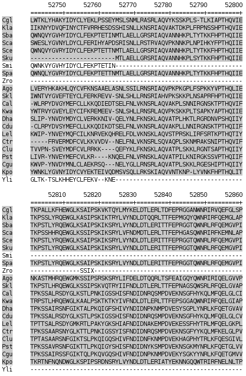
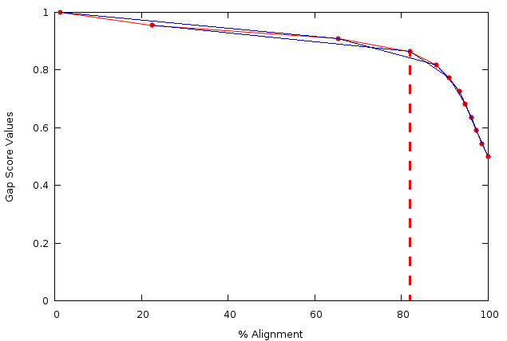
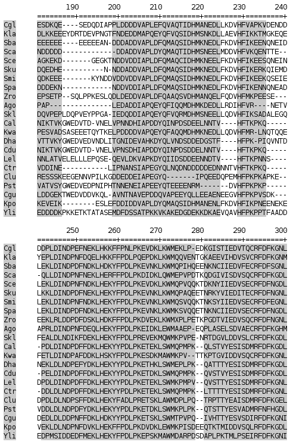
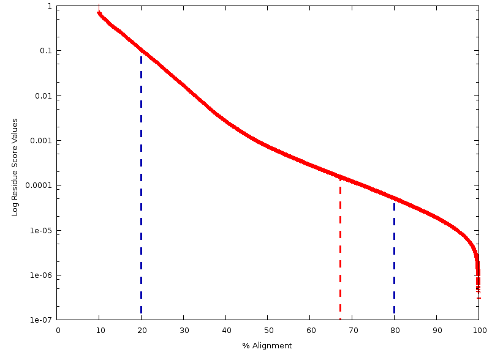
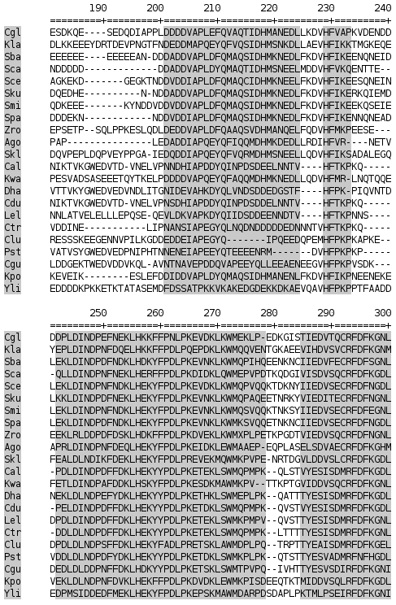
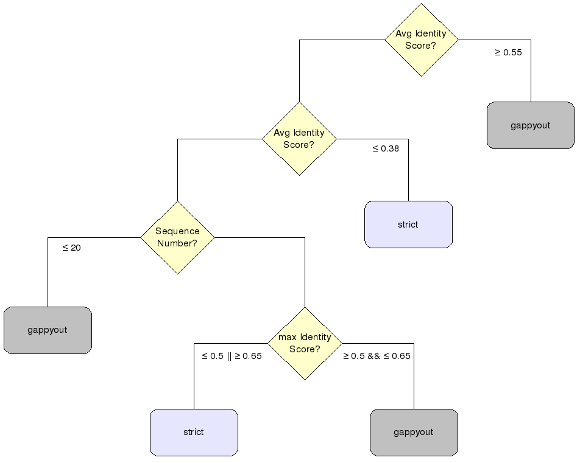

Trimming algorithms
***********************

Manual methods
========================

Custom columns
------------------------
This algorithm eliminates a specified set of columns defined by the user. The set of columns to be removed should be provided as individual column numbers separated by commas, and/or as blocks of consecutive columns indicated by the first and last column numbers separated by a hyphen. In the following example::

-selectcols { n,l,m-k }

where n and l are interpreted single column numbers, while m-k is a range of columns (from column m to column k, both included) to be deleted. Note that column numbering starts from 0. For instance, the command::

-selectcols { 2,7,20-25,80-100 }

will remove columns 2 and 7, along with two blocks of columns ranging from column 20 to 25 and 80 to 100, respectively.

Threshold-based trimming
------------------------
The user can choose to remove all columns that do not meet a specified threshold or a combination of thresholds. The gap threshold (*-gt*) and similarity threshold (*-st*) represent the minimum values of the respective scores explained above and can be used individually or in combination. Like the scores they refer to, both thresholds range from 0 to 1.

trimAl provides two shortcuts to commonly used thresholds: *-nogaps* (equivalent to *-gt 1*), which deletes all columns with at least one gap, and *-noallgaps*, which removes columns composed solely of gaps.

In addition, the user can set a conservation threshold (*-cons*), indicating the minimum percentage of columns from the input alignment that should be retained in the trimmed alignment. This threshold is defined between 0 and 100 and takes precedence over all other thresholds. If any other threshold would result in a trimmed alignment with fewer columns than specified by the conservation threshold, trimAl adds more columns to meet the conservation threshold. These columns are added based on their scores, with a preference for columns with higher scores. In the case of equal scores, columns adjacent to already selected column-blocks and closer to the center of the alignment are added first, 
prioritizing the extension of longer and central blocks.

When provided with a set of multiple sequence alignments, trimAl calculates a consistency score for each alignment in the set. Subsequently, the alignment with the highest score is selected. The chosen alignment can undergo various trimming methods, one of which involves removing columns that exhibit lower consistency across the other alignments. To achieve this, the user can utilize the *-ct* parameter to define the minimum values for the consistency score, within the range of 0 to 1. Any columns not meeting this specified value will be removed. Alternatively, the conservation score, as explained previously, can also be employed here. Moreover, it can be used in conjunction with gap and/or similarity methods.

Overlap trimming
------------------------
trimAl can also remove poorly aligned or incomplete sequences considering the rest of
sequences in the MSA. For that purpose, the user has to define two thresholds:
First, the residue overlap threshold (-resoverlap) corresponds to the minimum residue
overlap score for each residue.
Second, the sequence overlap threshold (-seqoverlap) sets up the minimum percentage of
the residues for each sequence that should pass the residue overlap threshold in order to
maintain the sequence in the new alignment. Sequences that do not pass the sequence
overlap threshold will be removed from the alignment. Finally, all columns that only have
gaps in the new alignment will also be removed from the final alignment.

trimAl can effectively eliminate poorly aligned or incomplete sequences while considering the entire multiple sequence alignment (MSA). To achieve this, users need to specify two thresholds:

    1. **Residue Overlap Threshold (-resoverlap):** This threshold corresponds to the minimum residue overlap score required for each residue.

    2. **Sequence Overlap Threshold (-seqoverlap):** This threshold establishes the minimum percentage of residues within each sequence that must surpass the residue overlap threshold to retain the sequence in the new alignment. Sequences failing to meet this criterion will be excluded from the final alignment.

Additionally, columns exclusively filled with gaps in the new alignment will be systematically removed.

.. _overlap-example-figure:

    An example of an alignment trimmed with the overlap method. We have used the same alignment as in :numref:`gappyout-example-figure`. Conserved (grey) and trimmed (white) columns are indicated.

Automated methods
========================

.. _gappyout_method:
Gappyout method
------------------------
This method relies on the gap distribution within the multiple sequence alignment (MSA). This method relies on the gap distribution within the Multiple Sequence Alignment (MSA). Initially, the method calculates gap scores for all columns and arranges them based on this score, generating a plot depicting potential gap score thresholds versus the percentage of the alignment below each threshold (see :numref:`gappyout-figure`). In the subsequent step, for every set of three consecutive points on this plot, trimAl computes the slopes between the first and third point, represented by blue lines. Following a comparison of all slopes, trimAl identifies the point with the maximal variation between consecutive slopes, indicated by a vertical red line in :numref:`gappyout-figure`.

.. _gappyout-figure:

    Example of an internal trimAl plot showing possible gap score thresholds (y axis) versus percentages of alignment length below that threshold (x axis). Thin blue lines indicate slopes computed by the program. The vertical red line indicates the cut-off point
    selected by the gappyout algorithm.

After determining a gap score cut-off point, trimAl removes all columns that do not meet this specified value (see :numref:`gappyout-example-figure`). In practical terms, this method effectively identifies the bimodal distribution of gap scores (columns rich in gaps and columns with fewer gaps) within an alignment. Subsequently, it eliminates the mode associated with a higher concentration of gaps. Our benchmarks indicate that this method efficiently eliminates a significant portion of poorly aligned regions.

.. _gappyout-example-figure:

    An example of an alignment trimmed with the gappyout method. Conserved (grey) and trimmed (white) columns are indicated. This figure has been generated with trimAl -htmlout option.

.. _strict_method:
Strict method
------------------------

This method combines gappyout trimming with subsequent trimming based on an automatically selected similarity threshold. To determine the similarity threshold, trimAl utilizes the residue similarity scores distribution from the multiple sequence alignment (MSA). This distribution is transformed to a logarithmic scale (refer to :numref:`strict-figure`), and the residue similarity cutoff is selected as explained below.

.. _strict-figure:

    trimAl's internal plot representing similarity score values versus the percentage of the alignment above that value. Vertical blue lines indicate the significant values at 20 and 80 percentiles. The cut-off point is indicated with a red vertical line.

From this similarity distribution, trimAl selects the values at percentiles 20 and 80 of the alignment length (vertical blue lines in :numref:`strict-figure`). The residue similarity threshold (vertical red line in :numref:`strict-figure`) is computed as follows:

    .. math::

        P_{20} = \log(\text{Simvalue}_{20})

        P_{80} = \log(\text{Simvalue}_{80})

        SimThreshold = \left(P_{80} + \frac{{P_{20} - P_{80}}}{10} \right)^{10}

This process is equivalent to establishing upper and lower boundaries for the threshold at percentiles 20 and 80, respectively, of the similarity score distribution in that alignment. The similarity threshold is calculated using the difference between these two boundaries, being at 1/10 to the lower boundary (similarity at P80).

This method of setting the similarity threshold has demonstrated optimal performance in our benchmarks. The lower and upper boundaries ensure that the 20% most conserved columns in the alignment are preserved, while the 20% most dissimilar columns are discarded.

The specific similarity threshold will lie between these boundaries depending on the distribution of similarity scores in the alignments. Alignments with steep similarity score curves and significant differences between the most similar and dissimilar columns will set more columns below the threshold. Conversely, alignments with more columns having scores similar to the most-conserved fraction will apply more relaxed cutoffs. However, the removal of a specific column will depend on its context.

Once trimAl has calculated the residue similarity cutoff, the following steps are taken:

    1. The :ref:`gappyout method <gappyout_method>` is applied to identify columns that would be deleted with that method.
    2. Residues below the similarity cutoff are marked.
    3. After applying these filters, trimAl recovers (unmarks) columns that have not passed the gap and/or similarity thresholds but where three of the four most immediate neighboring columns (two on each side) have passed them.
    4. Finally, in a last step, trimAl removes all columns that do not fall within a block of at least five consecutive columns unmarked for deletion.

.. _strict-example-figure:

    An example of an alignment trimmed with the strict method. We have used the same alignment as in :numref:`gappyout-example-figure`. Conserved (grey) and trimmed (white) columns are indicated.

Strictplus method
------------------------
This approach is very similar to the strict method. However, the final step of the algorithm is slightly different. In this case, the block size is defined as 1% of the alignment size with a minimum value of 3 and a maximum size of 12.

This method is optimized for neighbor joining phylogenetic tree reconstruction.

.. _strictplus-example-figure:
.. figure:: _static/strictplus_example.png
    :name: strictplus-example
    :width: 500px
    :align: center
    :alt: Strictplus example MSA

    An example of an alignment trimmed with strictplus method. In this case, the block size has automatically been set to 12 because the alignment length is greater than 1200 residues. Again, the same alignment as the previous figures :numref:`gappyout-example-figure` and :numref:`strict-example-figure` has been used.

Automated1 method
------------------------
Based on our own benchmarks with simulated alignments (see :doc:`benchmarking <benchmarking>`) we have designed a heuristic approach, denoted as automated1, to determine the optimal automatic method for trimming a given alignment. This heuristic is specifically fine-tuned for trimming alignments intended for maximum likelihood phylogenetic analyses.

Making use of a decision tree (:numref:`gappyout-example-figure`) , this heuristic dynamically selects between the :ref:`gappyout <gappyout_method>` and :ref:`strict <strict_method>` methods. In making this choice, trimAl considers the average identity score among all the sequences in the alignment, the average identity score for each most similar pair of sequences in the alignment, as well as the number of sequences in the alignment. We have observed that all these variables were important in deciding which method would provide the highest improvement on a given alignment.

.. _automated1-figure:

    A decision tree for the heuristic method automated1. trimAl uses strict (light blue) or gappyout (light grey) methods depending on 1) the average identity score (Avg. identity score) among the sequences in the alignment, 2) the number of sequences in the alignment and 3) the average identity score (max Identity Score) computed from the maximum identity score for each sequence in the alignment. We use light yellow color to highlight the decisions in the tree.

